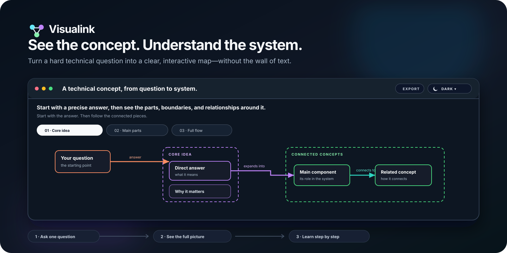
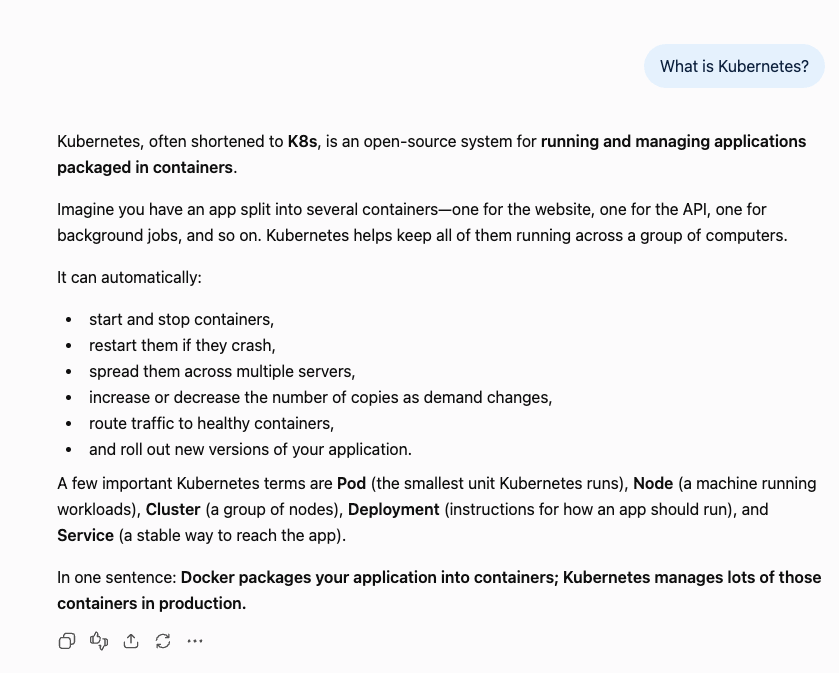
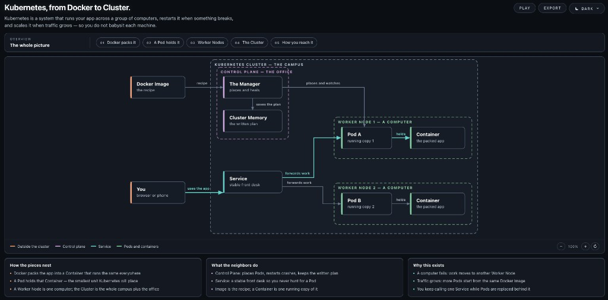
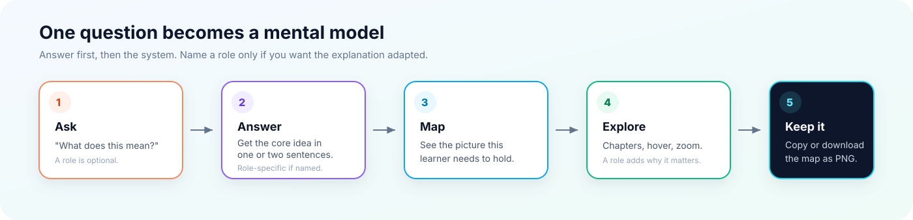

<p align="center">
  <a href="README.md">English</a> · <a href="README_ZH.md">简体中文</a>
</p>

# Visualink

**Turn difficult technical concepts into interactive maps you can actually understand.**

Visualink is an Agent Skill for non-technical people who need to understand an unfamiliar technical concept for learning or work. Ask in your own words and get a precise answer, a complete visual map, and a guided path through the ideas you need to know next.




## Why Visualink

This before/after uses one example question — "What is Kubernetes?" — to show the difference. Visualink is not limited to Kubernetes or to infrastructure.

Ask without this skill, and you get a long, accurate explanation. The terms are all there — Pod, Node, Cluster, Service — but you still have to assemble the picture yourself.

Use Visualink, and the same question becomes a map you can scan, replay, and keep.

<table>
<tr>
<td width="50%" valign="top">

## Before

Without Visualink: a wall of text.



You finish reading, but still cannot see how the pieces nest, who talks to whom, or why the system exists.

</td>
<td width="50%" valign="top">

## After

With Visualink: a map you can keep.



Same question. Now the answer, the whole system, and the path through it are visible at once. Open the [live Kubernetes example](https://jessiedengjie.github.io/Visualink/kubernetes-explained.html).

</td>
</tr>
</table>

Kubernetes is only the demonstration. Ask about networking, AI systems, developer tools, or another concept with components and a flow, and you should get the same kind of map.

That is the difference Visualink is built for:

- **Answer first** — understand the core idea in one or two sentences.
- **See the whole system** — begin with the complete map, not an isolated fragment.
- **Learn top-down** — move through guided chapters only when you are ready.
- **Discover the missing questions** — understand the components, dependencies, boundaries, and flows you did not yet know to ask about.
- **Keep the mental model** — copy or download the diagram as an image.



## Quick start

### 1. Install the skill

Clone or download this repository, then copy the skill into your agent's personal skills directory.

**Cursor**

```bash
mkdir -p ~/.cursor/skills/visualink
cp .cursor/skills/visualink/SKILL.md ~/.cursor/skills/visualink/SKILL.md
```

**Claude Code**

```bash
mkdir -p ~/.claude/skills/visualink
cp .cursor/skills/visualink/SKILL.md ~/.claude/skills/visualink/SKILL.md
```

**OpenAI Codex**

```bash
mkdir -p ~/.agents/skills/visualink
cp .cursor/skills/visualink/SKILL.md ~/.agents/skills/visualink/SKILL.md
```

In Codex, you can mention `$visualink` or ask the agent to use Visualink. Some setups still scan `~/.codex/skills/` as a fallback.

For project-only use, copy the skill into the matching directory inside your project:

- Cursor: `.cursor/skills/visualink/`
- Claude Code: `.claude/skills/visualink/`
- OpenAI Codex: `.agents/skills/visualink/`

### 2. Ask a normal question

```text
Use Visualink to explain [a technical concept] to me.
Assume I do not have a technical background.
```

You can also be more specific:

```text
I keep hearing the term [technical term] at work, but I do not understand it.
Use Visualink to show me what it means, how it works, what it connects to,
and why it matters in my role.
```

### 3. Open the result

Visualink creates one portable HTML file and opens it in your browser. No framework, build step, or design knowledge is required.

## What you get

Every explainer is designed around the same learning flow:

1. A direct definition of the concept
2. The complete system map
3. Numbered chapters that reveal the system step by step
4. Labeled connections that explain what moves where
5. Short cards covering structure, neighboring concepts, and purpose
6. Hover explanations, zoom, pan, and guided playback
7. Light and Dark themes
8. Copy image and Download PNG

## Current demos—not the limit

These two files demonstrate the interaction pattern. Visualink is not limited to these concepts or to infrastructure:

- [Kubernetes explained](https://jessiedengjie.github.io/Visualink/kubernetes-explained.html) — an example of explaining a layered technical system
- [Proxy MCP server explained](https://jessiedengjie.github.io/Visualink/proxy-mcp-server.html) — an example of explaining an end-to-end request flow

Download either HTML file and open it locally in a browser to use the full interaction.

## Good questions to ask

Visualink works best when the concept has components, boundaries, or a flow:

```text
What happens when I type a URL into a browser?
```

```text
What is retrieval-augmented generation, and how does data move through it?
```

```text
How does single sign-on work when I log in to a workplace application?
```

```text
What does an API gateway do between a client and several services?
```

```text
What happens to my data when a dashboard refreshes?
```

If the term has multiple meanings, Visualink should clarify the intended context before drawing.

## The Visualink approach

### Precise before comprehensive

The first explanation must answer the question. Related concepts come afterward and only when they help build the mental model.

### A map, not decoration

Nodes represent essential actors. Boundaries show containment. Arrows have directions and verb labels. Colors consistently identify semantic categories.

### Complete first, guided second

The default view shows the full picture. Chapters provide a learning path without pretending the selected fragment is the entire system.

### Friendly without becoming inaccurate

Plain language and short metaphors help with orientation, but technical relationships remain explicit and verifiable.

## Refine it in conversation

You do not need to describe CSS or diagram syntax. React to what you see:

```text
The outer system boundary is too faint in Dark mode.
```

```text
Make the Light theme brighter and the arrows easier to follow.
```

```text
Explain the central concept before expanding to its dependencies.
```

```text
The diagram feels too square. Use softer corners.
```

Visualink should change only the relevant part, preserve working interactions, and verify both themes after shared visual changes.

## Compatibility

The skill uses the portable `SKILL.md` Agent Skills format.

- **Cursor** — personal or project skills
- **Claude Code** — personal or project skills
- **OpenAI Codex** — personal (`~/.agents/skills`) or repository (`.agents/skills`) skills
- **Other coding agents** — point the agent to [the skill file](.cursor/skills/visualink/SKILL.md) if it can read local files or GitHub repositories

Browser-based verification and image export testing depend on the tools available to the agent.

## Repository structure

```text
Visualink/
├── .cursor/skills/visualink/SKILL.md   # The reusable Agent Skill
├── docs/assets/                        # GitHub onboarding visuals
├── kubernetes-explained.html           # Interactive example
├── proxy-mcp-server.html               # Interactive example
├── README.md                           # English onboarding
└── README_ZH.md                        # Chinese onboarding
```

## Design principles

- Start from the learner, not the system vocabulary.
- Show only the components needed to understand the question.
- Use visual hierarchy to reduce cognitive load.
- Make every important connection directional and named.
- Prefer one self-contained file that is easy to open and share.
- Verify the experience in the browser instead of trusting source code alone.

